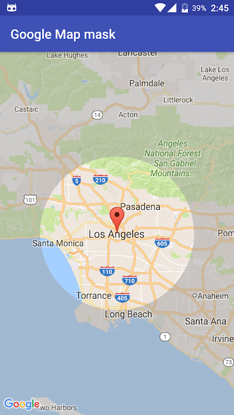

# Google Map mask
Small app which demonstrates how to create a circle hole for specified location.

This repository was created for answer to [this](http://stackoverflow.com/questions/39124706/android-google-maps-polygon-add-circle-hole) question. 

  